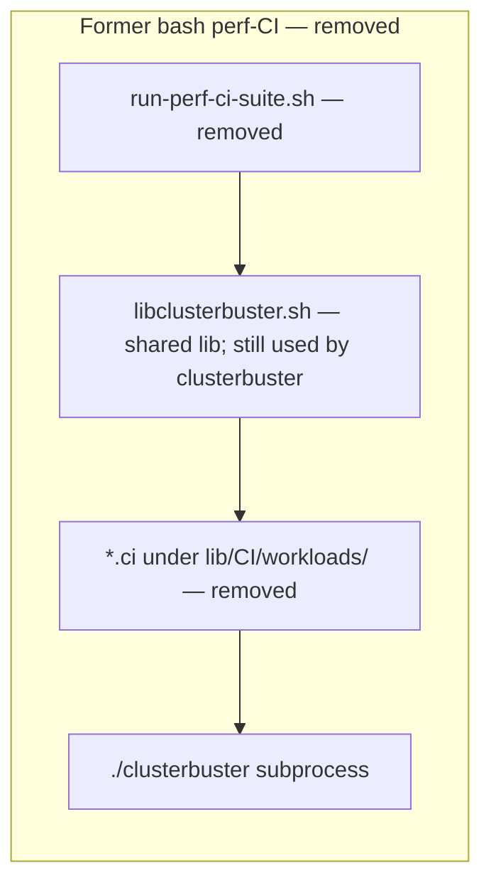
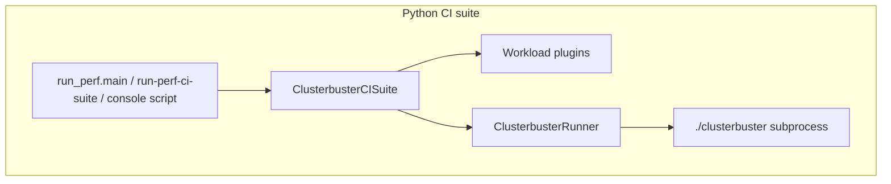

# ClusterBuster Phase 2: Python CI suite

This document is the **authoritative** reference for the **Python** CI implementation under [`lib/clusterbuster/ci/`](../lib/clusterbuster/ci/), packaged via [`pyproject.toml`](../pyproject.toml). The **canonical command** is **`run-perf-ci-suite`** (repo root launcher and `[project.scripts]` after install); see [CLI naming](#cli-naming). It describes **what the code does today**, how modules fit together, and what remains to build—not a migration story from other drivers.

**Bash / history in this doc:** Referring to the former bash CI driver, **`lib/libclusterbuster.sh`** function names, or removed **`*.ci`** paths is **fine for historical and porting context**. That is **not** the same as treating bash as a **parallel** supported implementation—there is **only** the Python CI orchestration path in this repository. The legacy **`scripts/run-perf-ci-suite.sh`** driver and **`lib/CI/workloads/*.ci`** fragments have been **removed**; [`lib/libclusterbuster.sh`](../lib/libclusterbuster.sh) remains because the main [`clusterbuster`](../clusterbuster) script still sources it for **`.workload`** plugins under [`lib/workloads/`](../lib/workloads/), not for perf-CI orchestration.

**Document status:** The **core** implementation (suite, workloads, execution, profiles, `run_perf.py`) is **largely complete**. Remaining work is **orchestration features** (see [Remaining backlog](#remaining-backlog)), **tests**, a **single** user-facing CLI (**`run_perf.main` only**—no second main entry; **`python -m`** must **never** be required for documented use), and packaging polish.

**Structured result (`ClusterbusterCISuiteResult`) deferral:** A frozen **`ClusterbusterCISuiteResult`**, **`run_perf_ci_suite() -> ClusterbusterCISuiteResult`**, exit-code table **2/3**, and **single-writer** JSON built from that type are **deferred goals**—they are **not** Phase 2 completion criteria. Until that milestone ships, **`ClusterbusterCISuite.run()`** and **`run_perf_ci_suite()`** return **`int`**; **`write_ci_results_json`** remains the writer for **`clusterbuster-ci-results.json`**. See [Deferred goals](#deferred-goals).

## Goals

Phase 2 **delivers** the items below. **Programmatic structured results** and the **Phase 3+ driver boundary** are **deferred**; they are listed in [Deferred goals](#deferred-goals), not here.

- **Single CLI:** There is **exactly one** supported main CLI: **`run_perf.main`**. The **`cli.main`** path is **not** a second user-facing entry; it forwards to **`run_perf.main`**. It must **never** be necessary to invoke **`python -m …`** for any **documented** workflow: use the repo **`run-perf-ci-suite`** launcher and **`[project.scripts]`** after install; extend **that** entry with subcommands when needed (see backlog). **`python -m`** is for developers/tests only.
- **CLI and library:** The same behavior is available as that CLI and as **`ClusterbusterCISuite`** for larger Python test harnesses.
- **Workloads:** All six CI workloads (`memory`, `fio`, `uperf`, `files`, `cpusoaker`, `hammerdb`) are **Python plugins** under `workloads/`. **Orchestration** extras (Prometheus, global timeout, tee, venv, etc.) are tracked in [Remaining backlog](#remaining-backlog).

## Deferred goals

The following are **explicitly deferred**—design and backlog references exist so work is not forgotten, but they are **not** required to declare Phase 2 “done.”

- **Programmatic structured results:** In a **later milestone**, the **`run`** / **`run_perf_ci_suite`** path should return a **structured result** (see [Programmatic run result (deferred design)](#programmatic-run-result-deferred-design)), not merely an exit code: suite **status** plus **data sufficient to generate a report** or to **inspect failures in depth** without treating on-disk JSON as the only contract. Until then, callers rely on **`int`** exit codes and **`clusterbuster-ci-results.json`**.
- **Phase 3+ driver boundary:** The main [`clusterbuster`](../clusterbuster) script stays **non-Python** for Phase 2; the Python CI layer invokes it through **`ClusterbusterRunner`** (subprocess argv). A future phase may swap the runner for an in-process or API-native implementation (and may replace the shell driver); that is **out of scope** for Phase 2 close. See also **Out of scope (Phase 3+)** below.

## User-facing CLI

There is **one** supported user-facing CLI: **`clusterbuster.ci.run_perf`** (argument parsing, profiles, workloads, orchestration). **Requirement:** no user or published doc may be forced to run **`python -m clusterbuster…`**; the repo script and the installed console script must suffice. Everything else is **library API** or **non-user** (tests, REPL, optional `python -m` for developers).

### CLI naming

- **Canonical name:** **`run-perf-ci-suite`** everywhere: the **repo-root** launcher ([`run-perf-ci-suite`](../run-perf-ci-suite)) and **`[project.scripts]`** after **`pip install`** must use **this exact name** (not `clusterbuster-ci` or other aliases for Phase 2).

| How users run it | Role |
|------------------|------|
| **Repo root [`run-perf-ci-suite`](../run-perf-ci-suite)** | **`run_perf.main`**. Primary path for clone-and-run workflows. |
| **Installed console script** | **`[project.scripts]`** registers **`run-perf-ci-suite` = `clusterbuster.ci.run_perf:main`**. |

**Not part of the supported user story:** **`python -m clusterbuster.ci`**, **`python -m clusterbuster.ci.run_perf`**, or **`python -m clusterbuster.ci.profile_yaml`**. They may exist for development or tests, but **documentation and CI examples must not require them**. Use **`run-perf-ci-suite profile-yaml`** for YAML expansion in automation.

**Implementation:** **`__main__.py`** and **`cli.py`** delegate to **`run_perf.main`**; there is no second supported CLI surface.

## Current vs target architecture

**Former stack (historical reference — removed from the tree):** The diagram records the **old** perf-CI layout before Python owned orchestration: a bash driver under **`scripts/`** ( **`run-perf-ci-suite.sh`**, now deleted), sourced helpers in **`lib/libclusterbuster.sh`** (still in the repo for the main **`clusterbuster`** driver, not as a second CI entry), workload fragments **`lib/CI/workloads/*.ci`** (deleted), and per-job invocation of **`./clusterbuster`**. **Nothing in this subgraph is a supported or parallel implementation today**; it is documentation of what was replaced.



**Target architecture (Phase 2 — authoritative today):** The Python CI suite is the **only** supported orchestration path for `run-perf-ci-suite`; workloads are Python plugins; each job still runs the **`clusterbuster`** driver via subprocess argv.



## Public API

| Symbol | Role |
|--------|------|
| **`ClusterbusterCISuite`** | Orchestrates one full CI run: profiles/options, runtime classes, per-workload plugins, job execution, artifacts. **`run()`** returns **`int`** today; a structured return is **deferred** (see [Deferred goals](#deferred-goals)). |
| **`ClusterbusterCISuiteConfig`** | Dataclass holding artifact dir, workload list, runtime classes, global timeouts, pin nodes, UUID, dry-run (`-n`), passthrough args, optional **`partial_results_hook`**, etc. |
| **`ClusterbusterRunner`** | **Concrete** default: subprocess runner invoking `clusterbuster` with a full argv (and cwd/env). Custom runners may **subclass** this or satisfy a **`typing.Protocol`** if we split a `SubprocessClusterbusterRunner` later; Phase 2 should document the **one** extension pattern in code comments. |
| **`ClusterbusterRunResult`** | Per-subprocess result (`returncode`, `stdout`, `stderr`); public for custom runners. |
| **`ClusterbusterCISuiteResult`** | **Deferred:** suite-level structured outcome after a full run. Design: [Programmatic run result (deferred design)](#programmatic-run-result-deferred-design). |
| **`run_perf_ci_suite(argv)`** | Programmatic entry matching the **full** CLI (`run_perf.main`); **returns `int`** today. Structured return and exit-code mapping from **`ClusterbusterCISuiteResult`** are **deferred**. Exported from `clusterbuster.ci` (lazy). |
| **`load_yaml_profile` / `resolve_profile_path`** | Profile loading; exported from `clusterbuster.ci` (lazy) for library callers and tests. |
| **`WorkloadPlugin`** | Protocol per workload: **`initialize_options`**, **`process_option`**, **`run`** the test matrix. |

### Programmatic run result (deferred design)

**Status:** **Deferred goal**—not part of Phase 2 delivery. Phase 2 uses **`int`** returns and **`write_ci_results_json`** only. This subsection records the **intended** API and contracts for a **later milestone** so implementation does not diverge silently.

**`ClusterbusterCISuiteResult`** is the **frozen public name** for the future structured API (export via **`__all__`** in `clusterbuster.ci`). If a breaking rename is ever needed, use a **versioned alias** or explicit deprecation cycle—not silent renames.

**Canonical builder (when implemented):** **`ClusterbusterCISuite.run()`** (or the single internal method it delegates to) **constructs** the **`ClusterbusterCISuiteResult`**. **`run_perf_ci_suite`** is a **thin wrapper** (parse argv → suite → result); it must **not** return a **different** shape than **`ClusterbusterCISuite.run()`** for the same logical run.

**Transition from `int`:** Avoid an open-ended **`int | ClusterbusterCISuiteResult`**. Prefer a **bounded** transition: e.g. **`run_perf_ci_suite_legacy() -> int`** (deprecated) alongside **`run_perf_ci_suite() -> ClusterbusterCISuiteResult`**, or a **single** function with a **`return_structured: bool`** flag removed after one release—pick one approach and document the **end date** in release notes.

**Exit code mapping (`main()`):** Document explicitly (and test) mapping from **`ClusterbusterCISuiteResult`** to process exit status, e.g.:

| Exit code | Meaning |
|-----------|---------|
| `0` | Suite completed successfully (no job failures, not interrupted). |
| `1` | One or more job failures or suite-level failure. |
| `2` | Interrupted / incomplete (when wired; may be unused until signal handling lands). |
| `3` | Timed out (when global timeout wired). |

**JSON alignment and single writer:** Every field in **`clusterbuster-ci-results.json`** that external tools rely on must appear on **`ClusterbusterCISuiteResult`**, or be listed explicitly as **file-only** (e.g. large blobs). Prefer **one code path**: **build `ClusterbusterCISuiteResult` → serialize to JSON** (do not maintain independent JSON construction that can drift from the in-memory object).

**Status values:** **`result`** strings in **`clusterbuster-ci-results.json`** should use **one canonical** set (`PASS`, `FAIL`, `INCOMPLETE`, `TIMEDOUT`, and whether **`PASSING` / `FAILING`** intermediate states exist). If the schema changes, bump **`version`** in the file. Until P1 signal handling and global timeout exist, **`INCOMPLETE` / `TIMEDOUT`** may be omitted in practice; document that as acceptable until those features land.

**Drill-down and subprocess output:** **`ClusterbusterRunResult`** may hold **in-memory** stdout/stderr. For suite results, prefer **paths under the artifact dir** for large captures once written, and **bounded** in-memory excerpts or hashes where needed—document caps in implementation so CI runs do not OOM.

**`partial_results_hook`:** After **`ClusterbusterCISuiteResult`** exists, specify whether the hook receives **`(suite, partial: ClusterbusterCISuiteResult | None)`** or the prior shape, and version the hook contract if the signature changes.

**When implemented (same deferred milestone):** “Report-grade” payload means **the same fields and per-job columns as today’s `clusterbuster-ci-results.json` contract**—not open-ended richer embeddings (e.g. full Prometheus series). Anything beyond that is **Phase 3+** or an optional extension type.

The structured object (when it exists) must carry:

1. **Status** — Suite-level outcome aligned with **`clusterbuster-ci-results.json`** semantics.
2. **Report-grade data (bounded)** — Same information as the on-disk summary and job rows: UUID, artifact root, workload list, per-job outcomes, timing, and references to logs as above.
3. **Drill-down** — Per-job exit codes, artifact paths, optional error strings/counters, restart/`partial_results_hook` compatibility as specified.

On-disk **`clusterbuster-ci-results.json`** remains the **durable interchange** for external tools; the structured return is the **in-process** equivalent. Until implemented, use a **documented** transitional API (see above), not an ambiguous return type.

## Package layout

```
lib/clusterbuster/ci/
  __init__.py          # exports suite, config, runner, run_perf_ci_suite (lazy), profile helpers (lazy), __all__ for public names
  __main__.py          # delegates to run_perf.main
  cli.py               # shim to run_perf.main
  run_perf.py          # full orchestration + main(); CISuiteState, pin nodes, artifact dir, JSON
  help_text.py         # full --help text for run-perf-ci-suite
  config.py            # ClusterbusterCISuiteConfig
  suite.py             # ClusterbusterCISuite
  runner.py            # ClusterbusterRunner, ClusterbusterRunResult
  profile_yaml.py      # YAML profiles; library + run-perf-ci-suite profile-yaml subcommand
  ci_options.py        # parse_ci_option / workload:runtime scoping
  registry.py          # workload name → plugin
  execution.py         # run_clusterbuster_job, argv build, known-option scrape
  helpers.py           # compute_timeout, get_node_memory_bytes, …
  restart.py           # completed-job detection, UUID recovery for --restart
  compat/
    sizes.py
    options.py
  workloads/
    memory.py … hammerdb.py
```

**Deferred (Phase 3+):** `compat/*` and `ci_options.py` are candidates to merge into a future `clusterbuster.core` once the main driver is Python—**not** a Phase 2 task.

## New workloads vs other CI changes

**Adding a new workload** (another matrix under the six-style model) is intentionally narrow: implement a class satisfying **`WorkloadPlugin`** in `workloads/`, register it in **`default_registry()`** in [`registry.py`](../lib/clusterbuster/ci/registry.py), extend **`help_text`** if users need new option documentation, and add YAML profile keys under `lib/CI/profiles/` as needed. That path is **not** expanded here.

The sections below apply when you need **other** capabilities: new global flags, new orchestration, different subprocess behavior, artifact/restart rules, hooks, or profile machinery—not “one more workload plugin.”

## Module interfaces

Call graph for a normal run (simplified):

`run_perf.main` → `configure_clusterbuster_ci_logging` → `parse_argv` / `apply_process_option` (profiles expand to option lines) → `run_suite_with_orchestration` → builds **`ClusterbusterCISuiteConfig`** → **`ClusterbusterCISuite.run()`** → each workload **`plugin.run(suite, default_job_runtime)`** → **`suite.run_clusterbuster_1`** → **`execution.run_clusterbuster_job`** → **`ClusterbusterRunner.run`**.

| Module / unit | Primary responsibility | Upstream (calls into it) | Downstream (it calls) | Stable hand-offs |
|---------------|------------------------|---------------------------|------------------------|------------------|
| **`logging_config`** | Attach stdout/stderr handlers for the `clusterbuster.ci` logger tree. | `run_perf.main`, `profile_yaml.main` (standalone) | — | Loggers named under `clusterbuster.ci.*`; no raw `print` in CI paths. |
| **`help_text`** | Static `--help` body and option/workload descriptions. | `run_perf.print_help` | Imports workload classes only to render help strings. | `build_full_help(repo_root, profile_dir, …)` returns one string. |
| **`run_perf`** | CLI argv, **`CISuiteState`**, profile loading, pin nodes, runtimeclass filter, artifact root prep (incl. restart UUID), results JSON, **`main` / `run_perf_ci_suite`**. | Repo `run-perf-ci-suite`, `[project.scripts]` | `suite`, `restart`, `profile_yaml`, `registry.default_registry`, `help_text` | State → `ClusterbusterCISuiteConfig`; template `artifactdir` resolved to `Path`; `write_ci_results_json` on the artifact root. |
| **`restart`** | `is_report_dir` ( **`clusterbuster-report.json`** / **`.gz`** ), **`recover_uuid_from_artifact_root`**, **`extract_metadata_uuid`**. | `run_perf` (artifact prep), `suite` (job completion check via `is_report_dir`) | — | Same on-disk markers the `clusterbuster` driver uses for finished reports. |
| **`profile_yaml`** | YAML → ordered `key=value` lines; path resolution; **`profile-yaml` subcommand** via `run_perf.main` branch. | `run_perf.process_profile`, tests, users | `yaml` | **`load_yaml_profile`**, **`resolve_profile_path`**, **`document_to_option_lines`** — lines fed to **`apply_process_option`**. |
| **`config`** | **`ClusterbusterCISuiteConfig`** dataclass: workloads, runtime classes, artifact dir, UUID, `extra_args`, pins, `partial_results_hook`, `hard_fail_on_error`, etc. | `run_perf` | `suite` | Immutable-ish contract for one suite run; new cross-cutting flags usually need a new field here **and** wiring in `run_perf`. |
| **`suite`** | **`ClusterbusterCISuite`**: workload loop, **`process_workload_options`** (plugin + passthrough **`clusterbuster` argv**), **`run_clusterbuster_1`**, job list / failures / timings, **`_hard_fail_abort`**. | `run_perf` | `execution`, `runner`, `registry`, `ci_options` (via plugins), **`restart.is_report_dir`** passed into execution | **`RunJobParams`** into **`run_clusterbuster_job`**; **`partial_results_hook(self)`** after each job. |
| **`execution`** | **`build_clusterbuster_argv`**, **`run_clusterbuster_job`** (skip-if-done, delay, subprocess, `.tmp` → final rename / `.FAIL`), **`load_known_clusterbuster_options`** (cached scrape of `clusterbuster -h`). | `suite` | `runner` | **`RunJobParams`** + paths; **`is_report_dir`** injectable for tests. |
| **`runner`** | **`ClusterbusterRunner.run(argv, cwd=, env=)`** → **`ClusterbusterRunResult`**. | `execution` | `subprocess` | Replace this class to mock, remote-wrap, or cap capture size. |
| **`ci_options`** | **`parse_ci_option`**, **`splitarg`**, quoted-arg splitting — workload/runtime-scoped CI tokens. | `suite.process_workload_options`, workload **`process_option`** | `compat.options` | String options from profile/CLI → structured **`ParsedCiOption`**. |
| **`compat`** | Size and bool/list parsing shared across CI option handling. | `ci_options`, workloads, `helpers` | — | Stable helpers for token shapes. |
| **`registry`** | **`WorkloadPlugin`** protocol, **`default_registry()`** name → plugin. | `run_perf`, `suite` | `workloads.*` | Dict keys = workload names and aliases. |
| **`helpers`** | Timeouts, node memory, math helpers for workloads. | Workloads, `suite` (indirect) | — | Pure utilities. |

## Extending the CI suite (beyond a new workload module)

Use this as a checklist by *kind* of change. In every case, add or update **tests** (`tests/test_ci_parity.py`, `test_profile_yaml.py`, `test_restart.py`, or new focused tests) and keep **logging** on `clusterbuster.ci.*` loggers.

### New CLI flag or profile key

1. **`run_perf`**: extend **`CISuiteState`** if it is global; handle the token in **`apply_process_option`** (or ensure YAML maps to an existing handler). Positional workload list remains in **`parse_argv`**.
2. **`help_text`**: document the option in **`build_full_help`** / workload sections so **`run-perf-ci-suite --help`** stays accurate.
3. **Profiles**: add keys under **`lib/CI/profiles/*.yaml`**; confirm **`profile_yaml`** emits the expected lines (list values become repeated keys).
4. If the value must reach **`clusterbuster` unchanged** and is not workload-specific, it typically flows **`config.extra_args`** → **`suite.process_workload_options`** → appended as `--name=value` when **`load_known_clusterbuster_options`** recognizes the normalized name.

### New `run-perf-ci-suite` subcommand

Mirror **`profile-yaml`**: branch on **`argv[0]`** early in **`run_perf.main`** after **`configure_clusterbuster_ci_logging`**, delegate to a dedicated **`main(argv)`** in the relevant module, and document the subcommand in **`help_text`**. Avoid requiring **`python -m`** for documented flows.

### New global behavior (before / after the workload loop)

Implement in **`run_suite_with_orchestration`** (or helpers it calls): examples include tee of stdout/stderr, global timeout monitor, venv creation, **`force_pull`**, post-run analyze hook. You will usually:

- Add fields to **`CISuiteState`** and **`ClusterbusterCISuiteConfig`**.
- Pass new behavior via config or closures (e.g. existing **`partial_results_hook`** pattern for per-job side effects).

### Changing per-job argv or artifact lifecycle

- **Argv shape / flags**: **`execution.build_clusterbuster_argv`** and **`run_clusterbuster_job`** (rename rules, skip-if-report-present, **`restart`**).
- **What counts as “job already done”**: **`restart.is_report_dir`** (presence of **`clusterbuster-report.json`** or **`.gz`** in the job directory).
- **UUID / artifact root policy on resume**: **`restart.recover_uuid_from_artifact_root`** and the **`restart` vs non-`restart`** branch in **`run_suite_with_orchestration`** that prepares **`artifactdir`**.

### Changing how `clusterbuster` is invoked

Subclass or replace **`ClusterbusterRunner`**: preserve **`run(argv, cwd=, env=) -> ClusterbusterRunResult`**. Inject via **`ClusterbusterCISuite(..., runner=...)`** for library callers; the CLI path currently constructs the default runner inside **`ClusterbusterCISuite.__init__`**—extending the CLI to accept a custom runner would require an explicit change in **`run_perf`** / config.

### Changing scoped CI option grammar

Edit **`ci_options.parse_ci_option`** (and tests) when introducing new **`workload:runtime`** patterns or volume/limit scoping strings. Workloads should keep **`process_option`** thin: return **`False`** for tokens they do not own so passthrough logic can forward recognized **`clusterbuster`** flags.

### Results file or hook contract

- **`write_ci_results_json`** in **`run_perf`**: keep output valid JSON (e.g. **`json.dumps`** for structured fields) when adding keys.
- **`partial_results_hook`**: receives **`ClusterbusterCISuite`**; do not break callers without a version note in this doc or release notes.

### Imports and package boundary

- **`clusterbuster.ci`**: lazy exports in **`__init__.py`**; add new public names to **`__all__`** only when they are part of the supported library API.
- Avoid circular imports: **`run_perf`** should not import **`suite`** at module top beyond what already exists; prefer local imports inside functions where the tree requires it.

## Porting map (historical — bash to Python)

**Historical reference only:** The table records **where today’s Python modules replaced earlier shell logic**. [`lib/libclusterbuster.sh`](../lib/libclusterbuster.sh) still exists for the main **`clusterbuster`** driver; the **perf-CI-only** bash driver and **`*.ci`** files are **gone** from the repository (see [`scripts/README.md`](../scripts/README.md) and [`lib/CI/workloads/README.md`](../lib/CI/workloads/README.md)). Mentioning bash here is **for history**, not a second supported stack—see [Current vs target architecture](#current-vs-target-architecture).

| Concern | Bash / shell source (historical) | Python module (authoritative today) |
|---------|----------------------------------|-------------------------------------|
| Size parsing | `parse_size` in [`lib/libclusterbuster.sh`](../lib/libclusterbuster.sh) | `clusterbuster.ci.compat.sizes` |
| Option tokens | `parse_option`, `parse_optvalues`, `bool` in [`lib/libclusterbuster.sh`](../lib/libclusterbuster.sh) | `clusterbuster.ci.compat.options` |
| Scoped CI options | `parse_ci_option`, `_check_ci_option` (former `run-perf-ci-suite.sh`, removed) | `clusterbuster.ci.ci_options` |
| Job argv + artifacts | `run_clusterbuster_1` (former `run-perf-ci-suite.sh`, removed) | `clusterbuster.ci.execution` + `ClusterbusterCISuite` |

## Workload plugins

| Workload | Python module |
|----------|---------------|
| memory | `clusterbuster.ci.workloads.memory` |
| fio | `clusterbuster.ci.workloads.fio` |
| uperf | `clusterbuster.ci.workloads.uperf` |
| files | `clusterbuster.ci.workloads.files` |
| cpusoaker | `clusterbuster.ci.workloads.cpusoaker` |
| hammerdb | `clusterbuster.ci.workloads.hammerdb` |

## Orchestrator responsibilities

The Python suite should **implement** or **deliberately document** gaps for:

- CLI: long options (`--key=value`), repeated `-n` for dry run, workload list positional args (**done** in `run_perf.parse_argv`).
- Profile files: [`lib/CI/profiles/*.yaml`](../lib/CI/profiles/) — YAML expanded internally (**done**); documented entry is **`run-perf-ci-suite profile-yaml`**, not **`python -m …`**. Optional **`.profile`** line files: comments stripped; **line continuation** across physical lines — **partial** (see backlog).
- Runtime class discovery and filtering (`check_runtimeclass`, aarch64 + VM policy via `CB_ALLOW_VM_AARCH64`) — **done** in `run_perf.filter_runtimeclasses`.
- Job execution: artifact dirs, tmp `.tmp` rename, failure suffix, counters, job timing — **done** in `execution` + `suite`. **`hard_fail_on_error`** (abort after first failing job) — **done** in `suite` + `run_perf`. **Restart UUID recovery** — **done** in `restart.py` + `run_perf`.
- Side features: see [Remaining backlog](#remaining-backlog).

## Remaining backlog

Each item should either be **implemented** or marked as a **documented non-goal** with brief rationale (here or in release notes). Items under **Deferred — programmatic API and structured results** are **goals for a later milestone**, not Phase 2 exit criteria (see [Deferred goals](#deferred-goals)).

### P0 — correctness / contract

| Item | Notes |
|------|--------|
| **`clusterbuster-ci-results.json` `result` values** | **Pick one canonical** set of strings (including whether **`PASSING` / `FAILING`** exist); if the schema changes, bump a **`version`** field in the JSON. |
| **`.profile` line continuation** | When loading `.profile` files, join continued lines before `process_option` (full continuation spec TBD in implementation). |

### Deferred — programmatic API and structured results

**Not** Phase 2 close criteria; tracked here so the design in [Programmatic run result (deferred design)](#programmatic-run-result-deferred-design) stays actionable when scheduled.

| Item | Notes |
|------|--------|
| **`ClusterbusterCISuiteResult` + `run_perf_ci_suite` return** | Implement the structured type; **`ClusterbusterCISuite.run()`** builds it; **`run_perf_ci_suite`** wraps it. Wire **`main()`** → exit code per [documented mapping](#programmatic-run-result-deferred-design). |
| **Result contract tests** | Unit tests for **`ClusterbusterCISuiteResult`** contents, **JSON round-trip** equality, and **golden** result fixtures for fixed inputs. |

### P1 — orchestration side features

| Item | Notes |
|------|--------|
| **Tee** `stdout`/`stderr` to `artifactdir/stdout.perf-ci-suite.log` and `stderr.perf-ci-suite.log` | Duplicate process streams to per-run log files under the artifact root. |
| **Global `run_timeout` + monitor** | Background timer; notify the orchestrator on expiry. |
| **Signal handling** | TERM/INT/HUP/EXIT cleanup for incomplete runs. |
| **Prometheus snapshot** | Start + retrieve in finish path when wired. |
| **`force_pull_clusterbuster-image`** | Invoke **[`lib/force-pull-clusterbuster-image`](../lib/force-pull-clusterbuster-image)** (or repo-root **[`force-pull-clusterbuster-image`](../force-pull-clusterbuster-image)** per install layout) when option set. |
| **Python venv + analyze** | `use_python_venv`: create temp venv, install deps; on success run **`analyze-clusterbuster-report`** when `analyze_results` / `analysis_format` set. |

### P2 — tests, packaging polish, docs

| Item | Notes |
|------|--------|
| **Tests: `parse_ci_option` matrix** | Expand coverage (`tests/test_ci_parity.py`). |
| **Tests: argv regression** | Same inputs → same `clusterbuster` argv (golden/snapshot tests for representative profiles + workloads). |
| **YAML profile tests** | Broaden `tests/test_profile_yaml.py` toward full `lib/CI/profiles/*.yaml` coverage. |

### Intentionally lower priority / noop

| Item | Notes |
|------|--------|
| **Short option `-B`** | Documented as noop in older tooling; Python rejecting unknown short flags is acceptable. |
| **`prerun` / `postrun`** | **Out of scope** for Phase 2 unless product asks for hooks. |

## Testing strategy

- **Unit**: `parse_size`, `parse_ci_option` — expand coverage (`tests/test_ci_parity.py`).
- **Component**: constructed argv for fixed config + profile snippets per workload; **argv snapshot / golden** tests (see backlog).
- **YAML**: golden tests for profile expansion (`tests/test_profile_yaml.py` — broaden coverage).
- **Integration**: `./clusterbuster -n` / `run-perf-ci-suite -n` per project rules; full live runs where applicable. The **`func_ci`** profile ([`lib/CI/profiles/func_ci.yaml`](../lib/CI/profiles/func_ci.yaml)) typically takes **more than two wall-clock hours** on a cluster; allow **about three hours** when scheduling or when tooling applies a wait timeout (e.g. remote **`ssh`** runs).

## Entry points

- **Repo root [`run-perf-ci-suite`](../run-perf-ci-suite)** is the supported CLI (see [User-facing CLI](#user-facing-cli)).
- Downstream consumers should use **`run-perf-ci-suite`** and documented **`profile-yaml`**; avoid **`python -m`** in published CI recipes.

## Future work (post–Phase 2)

**Profile authoring and YAML typing:** Many profile and CI options are still **structured strings** (colon-separated matrices, comma lists in one value, etc.). A follow-on effort should move these to **native YAML data types** in `lib/CI/profiles/*.yaml` (and corresponding handling in `profile_yaml` / `process_option`), so profiles are easier to validate, diff, and edit.

Concrete directions:

- **Parameterized workload specs** — Options such as **`files-params`**, **`memory-params`**, and **`hammerdb-params`** as **YAML sequences and mappings** rather than a single encoded string per row.
- **Comma-delimited lists** — Replace comma-separated scalars in strings with **YAML arrays** where the meaning is “list of values.”
- **Resource limits and requests** — Structured fields (numbers + units or nested objects), not opaque strings, unless a downstream API requires a single string.
- **Scoped / matrix options** — Constructs such as **`volume:files,fio:!vm=…`** as first-class YAML structure instead of encoding scope in one string.

Phase 2 treats YAML profiles as the supported authoring format while expanding them to **`key=value`** lines for **`process_option`**. The future step is to **narrow or eliminate** that string layer for new or migrated profiles.

## Out of scope (Phase 3+)

Aligned with [Deferred goals](#deferred-goals) (driver boundary and beyond):

- Replacing the main [`clusterbuster`](../clusterbuster) script.
- Rewriting [`lib/workloads/*.workload`](../lib/workloads/) — only **CI orchestration** and **CI workload matrices** live in `clusterbuster.ci`.
