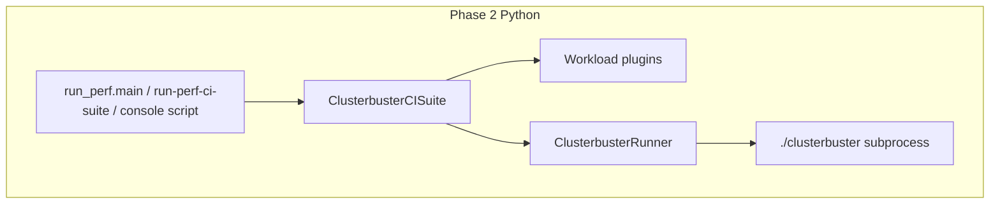

# ClusterBuster Phase 2: Python CI suite

This document describes the design for replacing the legacy shell CI driver and the sourced shell fragments under [`lib/CI/workloads/`](../lib/CI/workloads/) with a modular Python package under **`lib/clusterbuster/ci/`**, installable via the existing [`pyproject.toml`](../pyproject.toml). The **canonical command name** remains **`run-perf-ci-suite`** (repo root → Python); see [CLI naming](#cli-naming).

**Document status:** The **core** Python port (suite, workloads, execution, profiles, `run_perf.py`) is **largely implemented**. Remaining work is **orchestration parity** with the historical shell driver behavior, **tests**, **one** user-facing parity CLI ( **`run_perf.main` only**—no second main entry; **`python -m`** must **never** be required for documented use), and **packaging** (`[project.scripts]` + repo launcher). The [remaining backlog](#remaining-parity-backlog) is prioritized from bash parity, a second-pass adversarial review of the plan text, and maintainer decisions captured below.

## Goals

- **Single parity CLI**: There is **exactly one** supported main CLI: **`run_perf.main`** (full bash parity). The **`cli.main`** path is **not** a second user-facing entry; **converge it with `run_perf` or remove it**. It must **never** be necessary to invoke **`python -m …`** for any **documented** workflow: use the repo **`run-perf-ci-suite`** launcher and **`[project.scripts]`** after install; extend **that** entry with subcommands when needed (see backlog). **`python -m`** is for developers/tests only.
- **CLI and library**: The same parity behavior is available as that single CLI and as a **`ClusterbusterCISuite`** class for larger Python test harnesses.
- **Programmatic results**: The **`run`** / **`run_perf_ci_suite`** path returns a **structured result** (see [Programmatic run result](#programmatic-run-result)), not merely an exit code: suite **status** plus **data sufficient to generate a report** or to **inspect failures in depth** without treating on-disk JSON as the only contract.
- **Full parity**: All six CI workloads today (`memory`, `fio`, `uperf`, `files`, `cpusoaker`, `hammerdb`) are implemented as Python plugins; behavioral parity with the current bash `.ci` + `run_clusterbuster_1` paths is the acceptance bar for **job execution**. **Orchestration** parity (Prometheus, global timeout, tee, venv, etc.) is tracked in [Remaining parity backlog](#remaining-parity-backlog).
- **Shell fragments are not reused**: `.ci` files cannot be sourced from Python. Each workload’s matrix logic is reimplemented in Python (see *Why not wrap bash* below).
- **Phase 3 boundary**: The main [`clusterbuster`](../clusterbuster) script remains bash for Phase 2. The Python CI layer invokes it through a **`ClusterbusterRunner`** abstraction (typically subprocess argv). Phase 3 can swap the runner for an in-process or API-native implementation without rewriting orchestration or workload plugins.

## User-facing CLI

There is **one** supported user-facing CLI implementation: **`clusterbuster.ci.run_perf`** (argument parsing, profiles, workloads, orchestration—**bash parity**). **Requirement:** no user or published doc may be forced to run **`python -m clusterbuster…`**; the repo script and the installed console script must suffice. Everything else is either **library API** or **non-user** (tests, REPL, optional `python -m` for developers).

### CLI naming

- **Canonical name:** The user-facing command is **`run-perf-ci-suite`** everywhere: the **repo-root** launcher ([`run-perf-ci-suite`](../run-perf-ci-suite)) and the **`[project.scripts]`** entry after **`pip install`** must use **this exact name** (not `clusterbuster-ci` or other aliases for Phase 2).
- **Legacy shell (temporary):** A copy of the old driver may remain under **`scripts/`** only until parity checks complete; **`run-perf-ci-suite --help`** is fully described by **`clusterbuster.ci.help_text`** and the **`clusterbuster`** driver—users do not read that script for options.

| How users run it | Role |
|------------------|------|
| **Repo root [`run-perf-ci-suite`](../run-perf-ci-suite)** | Supported launcher: **`run_perf.main`** (same argv and behavior as the legacy bash driver). Primary path for clone-and-run workflows. |
| **Installed console script** | **`[project.scripts]`** must register **`run-perf-ci-suite` = `clusterbuster.ci.run_perf:main`** (same name as the repo script). **Required** for Phase 2 completion (see backlog). |

**Not part of the supported user story:** **`python -m clusterbuster.ci`**, **`python -m clusterbuster.ci.run_perf`**, or **`python -m clusterbuster.ci.profile_yaml`**. They may exist for development or tests, but **documentation and CI examples must not require them**. Profile expansion for shell scripts that today call **`python -m clusterbuster.ci.profile_yaml`** should move to a **`run-perf-ci-suite` subcommand** (e.g. `profile-yaml`) or equivalent on the single CLI so those callers also avoid **`python -m`** (backlog).

**Implementation note:** `__main__.py` should eventually delegate to **`run_perf.main`** (same binary behavior as the repo script); the separate simplified **`cli.main`** path is **not** a second supported CLI—converge or retire it so parity lives in one module.

## Current vs target architecture

```mermaid
flowchart LR
  subgraph today [Legacy reference]
    R[legacy shell driver (temporary)]
    L[libclusterbuster.sh]
    C[lib/CI/workloads/*.ci]
    B[./clusterbuster]
    R --> L
    L --> C
    C --> B
  end
```



## Public API

| Symbol | Role |
|--------|------|
| **`ClusterbusterCISuite`** | Orchestrates one full CI run: profiles/options, runtime classes, per-workload plugins, job execution, artifacts. **`run()`** produces the canonical **`ClusterbusterCISuiteResult`** (same object shape as **`run_perf_ci_suite`** after argv parsing). |
| **`ClusterbusterCISuiteConfig`** | Dataclass holding artifact dir, workload list, runtime classes, global timeouts, pin nodes, UUID, dry-run (`-n`), passthrough args, optional **`partial_results_hook`**, etc. |
| **`ClusterbusterRunner`** | **Concrete** default: subprocess runner invoking `clusterbuster` with a full argv (and cwd/env). Custom runners may **subclass** this or satisfy a **`typing.Protocol`** if we split a `SubprocessClusterbusterRunner` later; Phase 2 should document the **one** extension pattern in code comments. |
| **`ClusterbusterRunResult`** | Per-subprocess result (`returncode`, `stdout`, `stderr`); public for custom runners. |
| **`ClusterbusterCISuiteResult`** | Suite-level structured outcome after a full run: see [Programmatic run result](#programmatic-run-result). |
| **`run_perf_ci_suite(argv)`** | Programmatic entry matching the **full** CLI (`run_perf.main`); **returns `ClusterbusterCISuiteResult`** once the API is wired; **`main()`** maps that result to a **process exit code**. Exported from `clusterbuster.ci` (lazy). |
| **`load_yaml_profile` / `resolve_profile_path`** | Profile loading; exported from `clusterbuster.ci` (lazy) for library callers and tests. |
| **`WorkloadPlugin`** | Protocol per workload: **`initialize_options`**, **`process_option`**, **`run`** the test matrix. |

### Programmatic run result

**`ClusterbusterCISuiteResult`** is the **frozen public name** for Phase 2 (export via **`__all__`** in `clusterbuster.ci`). If a breaking rename is ever needed, use a **versioned alias** or explicit deprecation cycle—not silent renames.

**Canonical builder:** **`ClusterbusterCISuite.run()`** (or the single internal method it delegates to) **constructs** the **`ClusterbusterCISuiteResult`**. **`run_perf_ci_suite`** is a **thin wrapper** (parse argv → suite → result); it must **not** return a **different** shape than **`ClusterbusterCISuite.run()`** for the same logical run.

**Transition from `int`:** Avoid an open-ended **`int | ClusterbusterCISuiteResult`**. Prefer a **bounded** transition: e.g. **`run_perf_ci_suite_legacy() -> int`** (deprecated) alongside **`run_perf_ci_suite() -> ClusterbusterCISuiteResult`**, or a **single** function with a **`return_structured: bool`** flag removed after one release—pick one approach and document the **end date** in release notes.

**Exit code mapping (`main()`):** Document explicitly (and test) mapping from **`ClusterbusterCISuiteResult`** to process exit status to match bash `exit $fail` behavior, e.g.:

| Exit code | Meaning (align with bash `fail`) |
|-----------|-----------------------------------|
| `0` | Suite completed successfully (no job failures, not interrupted). |
| `1` | One or more job failures or suite-level failure. |
| `2` | Interrupted / incomplete (when wired; may be unused until signal handling lands). |
| `3` | Timed out (when global timeout wired). |

Adjust the table to match the **actual** bash script if audit shows different semantics; the plan requires **explicit** documentation, not ad hoc `bool(result)` mapping.

**JSON alignment and single writer:** Every field in **`clusterbuster-ci-results.json`** that external tools rely on must appear on **`ClusterbusterCISuiteResult`**, or be listed explicitly as **file-only** (e.g. large blobs). Prefer **one code path**: **build `ClusterbusterCISuiteResult` → serialize to JSON** (do not maintain independent JSON construction that can drift from the in-memory object).

**Status values:** Align **`result`** strings with bash `finis` (`PASS`, `FAIL`, `INCOMPLETE`, `TIMEDOUT`). **Pick one canonical set** for the JSON schema—including whether **`PASSING` / `FAILING`** intermediate states exist—and if the schema changes, bump **`version`** in the file rather than “maybe both.” Until P1 signal handling and global timeout exist, Python may omit **`INCOMPLETE` / `TIMEDOUT`** in practice; document that as **acceptable for P0** with those states appearing once the corresponding features land (minimal stubs that never trigger are **not** required).

**Drill-down and subprocess output:** **`ClusterbusterRunResult`** may hold **in-memory** stdout/stderr. For suite results, prefer **paths under the artifact dir** for large captures once written, and **bounded** in-memory excerpts or hashes where needed—document caps in implementation so CI runs do not OOM.

**`partial_results_hook`:** After **`ClusterbusterCISuiteResult`** exists, specify whether the hook receives **`(suite, partial: ClusterbusterCISuiteResult | None)`** or the prior shape, and version the hook contract if the signature changes.

**Phase 2 scope for payload:** “Report-grade” means **parity with existing JSON fields and per-job table columns**—not open-ended richer embeddings (e.g. full Prometheus series). Anything beyond that is **Phase 3+** or an optional extension type.

The structured object must carry:

1. **Status** — Suite-level outcome aligned with **`clusterbuster-ci-results.json`** / bash `finis` semantics.
2. **Report-grade data (bounded)** — Same information as the on-disk summary and job rows: UUID, artifact root, workload list, per-job outcomes, timing, and references to logs as above.
3. **Drill-down** — Per-job exit codes, artifact paths, optional error strings/counters, restart/`partial_results_hook` compatibility as specified.

On-disk **`clusterbuster-ci-results.json`** remains the **durable interchange** for external tools; the structured return is the **in-process** equivalent. Until implemented, use a **documented** transitional API (see above), not an ambiguous return type.

## Package layout

```
lib/clusterbuster/ci/
  __init__.py          # exports suite, config, runner, run_perf_ci_suite (lazy), profile helpers (lazy), __all__ for public names
  __main__.py          # target: delegate to run_perf.main (same as repo script); avoid a second CLI
  cli.py               # legacy / to converge with run_perf or remove—not a second supported user CLI
  run_perf.py          # full orchestration + main(); CISuiteState, pin nodes, artifact dir, JSON
  help_text.py         # full --help text (parity with former shell driver; no script pointers)
  config.py            # ClusterbusterCISuiteConfig
  suite.py             # ClusterbusterCISuite
  runner.py            # ClusterbusterRunner, ClusterbusterRunResult
  profile_yaml.py      # YAML profiles; library + optional run-perf-ci-suite subcommand (not python -m for users)
  ci_options.py        # parse_ci_option / workload:runtime scoping (bash parity)
  registry.py          # workload name → plugin
  execution.py         # run_clusterbuster_job, argv build, known-option scrape
  helpers.py           # compute_timeout, get_node_memory_bytes, …
  compat/
    sizes.py
    options.py
  workloads/
    memory.py … hammerdb.py
```

**Phase 3 note**: `compat/*` and `ci_options.py` are candidates to merge into a future `clusterbuster.core` once the main driver is Python.

## Porting map (from bash)

| Concern | Bash source | Python module |
|---------|-------------|----------------|
| Size parsing | `parse_size` | `clusterbuster.ci.compat.sizes` |
| Option tokens | `parse_option`, `parse_optvalues`, `bool` | `clusterbuster.ci.compat.options` |
| Scoped CI options | `parse_ci_option`, `_check_ci_option` | `clusterbuster.ci.ci_options` |
| Job argv + artifacts | `run_clusterbuster_1` | `clusterbuster.ci.execution` + `ClusterbusterCISuite` |

## Workload coverage (all six)

| Workload | Source fragment | Python module |
|----------|-----------------|---------------|
| memory | [`lib/CI/workloads/memory.ci`](../lib/CI/workloads/memory.ci) | `clusterbuster.ci.workloads.memory` |
| fio | [`lib/CI/workloads/fio.ci`](../lib/CI/workloads/fio.ci) | `clusterbuster.ci.workloads.fio` |
| uperf | [`lib/CI/workloads/uperf.ci`](../lib/CI/workloads/uperf.ci) | `clusterbuster.ci.workloads.uperf` |
| files | [`lib/CI/workloads/files.ci`](../lib/CI/workloads/files.ci) | `clusterbuster.ci.workloads.files` |
| cpusoaker | [`lib/CI/workloads/cpusoaker.ci`](../lib/CI/workloads/cpusoaker.ci) | `clusterbuster.ci.workloads.cpusoaker` |
| hammerdb | [`lib/CI/workloads/hammerdb.ci`](../lib/CI/workloads/hammerdb.ci) | `clusterbuster.ci.workloads.hammerdb` |

## Orchestrator responsibilities (from `run-perf-ci-suite`)

The Python suite must eventually match or **deliberately document** gaps for:

- CLI: long options (`--key=value`), repeated `-n` for dry run, workload list positional args (**done** in `run_perf.parse_argv`).
- Profile files: [`lib/CI/profiles/*.yaml`](../lib/CI/profiles/) — YAML expanded internally (**done**); users must not rely on **`python -m …profile_yaml`**. Legacy **`.profile`** line files: comments stripped; **backslash continuation** must match bash (read next physical line and concatenate) — **partial** (see backlog).
- Runtime class discovery and filtering (`check_runtimeclass`, aarch64 + VM policy via `CB_ALLOW_VM_AARCH64`) — **done** in `run_perf.filter_runtimeclasses`.
- Job execution: artifact dirs, tmp `.tmp` rename, failure suffix, counters, job timing — **done** in `execution` + `suite`. **Restart UUID recovery** from prior artifact dir — **missing** (see backlog).
- Side features: see [Remaining parity backlog](#remaining-parity-backlog).

## Remaining parity backlog

Prioritized from peer review and comparison with the historical shell driver behavior (until that implementation is removed). Each item should either be **implemented** or marked as a **documented non-goal** with brief rationale (here or in release notes).

### P0 — correctness / contract

| Item | Notes |
|------|--------|
| **`clusterbuster-ci-results.json` `result` values** | Align with bash `finis`. **Pick one canonical** set of strings (including whether **`PASSING` / `FAILING`** exist); if the schema changes, bump a **`version`** field in the JSON rather than supporting ambiguous duplicates. |
| **`.profile` backslash continuation** | Match bash: join continued lines before `process_option`. |
| **`hard_fail_on_error`** | Parse from options; abort suite after first failing job when set (bash `finis` path). |
| **Restart + UUID** | When `restart` and artifact dir present, recover `uuid` from existing report JSON (bash `jq` behavior). |
| **`ClusterbusterCISuiteResult` + `run_perf_ci_suite` return** | Implement the structured type; **`ClusterbusterCISuite.run()`** builds it; **`run_perf_ci_suite`** wraps it. Wire **`main()`** → exit code per [documented mapping](#programmatic-run-result). |
| **Result contract tests** | Unit tests for **`ClusterbusterCISuiteResult`** contents, **JSON round-trip** equality (serialize → parse → compare), and **golden** result fixtures for fixed inputs. |

### P1 — orchestration side features

| Item | Notes |
|------|--------|
| **Tee** `stdout`/`stderr` to `artifactdir/stdout.perf-ci-suite.log` and `stderr.perf-ci-suite.log` | Bash `exec > >(tee -a …)`. |
| **Global `run_timeout` + monitor** | Background timer; signal parent on expiry (bash `monitor` + `USR1`). |
| **Signal handling** | TERM/INT/HUP/EXIT cleanup analogous to bash `trap` + `finis`. |
| **Prometheus snapshot** | `take_prometheus_snapshot`: start + retrieve in finish path (bash `start_prometheus_snapshot` / `retrieve_prometheus_snapshot`). |
| **`force_pull_clusterbuster-image`** | Invoke **[`lib/force-pull-clusterbuster-image`](../lib/force-pull-clusterbuster-image)** (or repo-root **[`force-pull-clusterbuster-image`](../force-pull-clusterbuster-image)** per install layout) when option set. |
| **Python venv + analyze** | `use_python_venv`: create temp venv, install deps; on success run **`analyze-clusterbuster-report`** when `analyze_results` / `analysis_format` set (bash `finis`). |
| **`[project.scripts]` in `pyproject.toml`** | **Required:** `run-perf-ci-suite = "clusterbuster.ci.run_perf:main"` so **`pip install`** users get the same name as the repo script on **`PATH`**. |
| **Profile YAML without `python -m`** | Add **`run-perf-ci-suite profile-yaml`** (or equivalent subcommand) delegating to **`profile_yaml`** so shell tooling does not invoke **`python -m clusterbuster.ci.profile_yaml`**. |

### P2 — tests, packaging polish, docs

| Item | Notes |
|------|--------|
| **Tests: `parse_ci_option` matrix** | Expand toward embedded `test_parse` coverage from the historical shell driver. |
| **Tests: argv regression** | Same inputs → same `clusterbuster` argv (golden/snapshot tests for representative profiles + workloads). |
| **YAML profile tests** | Broaden `tests/test_profile_yaml.py` toward full `lib/CI/profiles/*.yaml` coverage. |

### Intentionally lower priority / noop

| Item | Notes |
|------|--------|
| **GETOPT `-B`** | Bash includes `B` in `getopts` string but has **no** `B)` branch — **noop**; Python rejecting unknown short flags is acceptable. |
| **`prerun` / `postrun`** | Variables exist in bash driver but are **not** populated from documented CLI in the same way; treat as **out of scope** for Phase 2 unless product asks for hooks. |

## Testing strategy

- **Unit**: `parse_size`, `parse_ci_option` — expand toward bash **`test_parse`** completeness (`tests/test_ci_parity.py`).
- **Component**: constructed argv for fixed config + profile snippets per workload; **argv snapshot / golden** tests for regression vs bash driver (see backlog).
- **YAML**: golden tests for profile expansion (`tests/test_profile_yaml.py` — broaden coverage).
- **Integration**: `./clusterbuster -n` / `run-perf-ci-suite -n` per project remote rules; full live runs where applicable.

## Migration (current state)

- **Repo root [`run-perf-ci-suite`](../run-perf-ci-suite)** is the **Python** parity CLI (see [User-facing CLI](#user-facing-cli)).
- **Reference:** any temporary shell copy under **`scripts/`** is for maintainer diff only until removed.
- Downstream consumers should use the Python **`run-perf-ci-suite`** and **stop** documenting **`python -m`** invocations for CI.

## Why not wrap bash

The `.ci` files depend on `source`, dynamic function names (`memory_test`), and globals injected by the driver (`runtimeclasses`, `counter`, `workload`). Calling `bash -c 'source …'` from Python is brittle and unmaintainable. Python uses explicit plugins and a typed execution context instead.

## Future work (post–Phase 2)

**Profile authoring and YAML typing:** Today, many profile and CI options are carried as **structured strings** that mirror the historical shell tokenization (colon-separated matrices, comma lists embedded in one value, etc.). A follow-on effort should move these to **native YAML data types** in `lib/CI/profiles/*.yaml` (and corresponding handling in `profile_yaml` / `process_option`), so profiles are easier to validate, diff, and edit without learning ad hoc micro-syntax.

Concrete directions:

- **Parameterized workload specs** — Options such as **`files-params`**, **`memory-params`**, and **`hammerdb-params`** should be expressed as **YAML sequences and mappings** (e.g. list of test matrices) rather than a single encoded string per row.
- **Comma-delimited lists** — Replace comma-separated scalars in strings with **YAML arrays** where the meaning is “list of values.”
- **Resource limits and requests** — Represent CPU/memory/storage limits and requests as **structured fields** (numbers + units or nested objects), not opaque strings, unless a downstream API truly requires a single string.
- **Scoped / matrix options** — Constructs such as **`volume:files,fio:!vm=…`** (workload/runtime-scoped volume and placement rules) should gain **first-class YAML structure** (e.g. nested objects keyed by workload, runtime class, or deployment type) instead of encoding scope and punctuation in one string.

This work is **orthogonal** to Phase 2’s “YAML-first” orchestration path: Phase 2 treats YAML profiles as the supported authoring format while still expanding them to **`key=value`** lines for **`process_option`** parity. The future step is to **narrow or eliminate** that string layer for new or migrated profiles.

## Out of scope (Phase 3+)

- Replacing the main [`clusterbuster`](../clusterbuster) bash script.
- Rewriting [`lib/workloads/*.workload`](../lib/workloads/) — only **CI orchestration** and **CI workload matrices** move into `clusterbuster.ci`.
