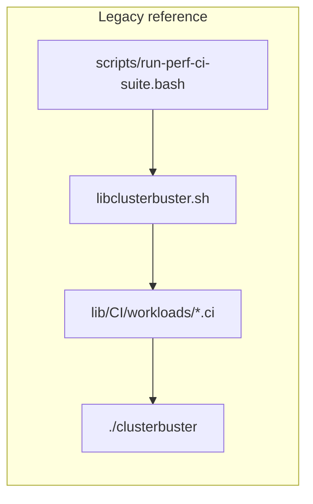
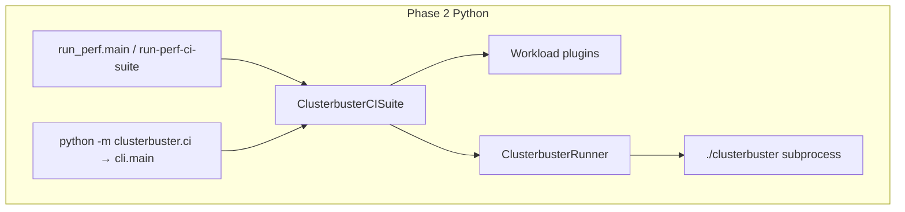

# ClusterBuster Phase 2: Python CI suite

This document describes the design for replacing the bash [`run-perf-ci-suite`](../run-perf-ci-suite) driver and the sourced shell fragments under [`lib/CI/workloads/`](../lib/CI/workloads/) with a modular Python package under **`lib/clusterbuster/ci/`**, installable via the existing [`pyproject.toml`](../pyproject.toml).

**Document status:** The **core** Python port (suite, workloads, execution, profiles, `run_perf.py`) is **largely implemented**. Remaining work is **orchestration parity** with [`scripts/run-perf-ci-suite.bash`](../scripts/run-perf-ci-suite.bash), **tests**, **packaging entry points**, and **documentation** of dual CLIs. The [remaining backlog](#remaining-parity-backlog) is prioritized from bash parity and internal peer review.

## Goals

- **CLI and library**: The same behavior is available as command-line entry points (see [Entry points](#entry-points-and-dual-clis)) and as a **`ClusterbusterCISuite`** class for larger Python test harnesses.
- **Programmatic results**: The **`run`** / **`run_perf_ci_suite`** path returns a **structured result** (see [Programmatic run result](#programmatic-run-result)), not merely an exit code: suite **status** plus **data sufficient to generate a report** or to **inspect failures in depth** without treating on-disk JSON as the only contract.
- **Full parity**: All six CI workloads today (`memory`, `fio`, `uperf`, `files`, `cpusoaker`, `hammerdb`) are implemented as Python plugins; behavioral parity with the current bash `.ci` + `run_clusterbuster_1` paths is the acceptance bar for **job execution**. **Orchestration** parity (Prometheus, global timeout, tee, venv, etc.) is tracked in [Remaining parity backlog](#remaining-parity-backlog).
- **Shell fragments are not reused**: `.ci` files cannot be sourced from Python. Each workload’s matrix logic is reimplemented in Python (see *Why not wrap bash* below).
- **Phase 3 boundary**: The main [`clusterbuster`](../clusterbuster) script remains bash for Phase 2. The Python CI layer invokes it through a **`ClusterbusterRunner`** abstraction (typically subprocess argv). Phase 3 can swap the runner for an in-process or API-native implementation without rewriting orchestration or workload plugins.

## Entry points and dual CLIs

| Entry | Role |
|-------|------|
| **Repo root [`run-perf-ci-suite`](../run-perf-ci-suite)** | Thin Python launcher → **`clusterbuster.ci.run_perf.main`**. Intended **bash-compatible** surface (long options, profiles, workloads). |
| **`python -m clusterbuster.ci.run_perf`** | Same implementation as root script (after `PYTHONPATH=lib` or install). |
| **`python -m clusterbuster.ci`** | **Simplified** argparse CLI (`cli.main`) for quick runs; **not** full parity with bash option surface. |
| **`python -m clusterbuster.ci.profile_yaml`** | Expands YAML profiles to `key=value` lines. |

User-facing docs should steer full CI suite users to **`run_perf`** / root script; steer minimal experiments to **`python -m clusterbuster.ci`**.

## Current vs target architecture





## Public API

| Symbol | Role |
|--------|------|
| **`ClusterbusterCISuite`** | Orchestrates one full CI run: profiles/options, runtime classes, per-workload plugins, job execution, artifacts. |
| **`ClusterbusterCISuiteConfig`** | Dataclass holding artifact dir, workload list, runtime classes, global timeouts, pin nodes, UUID, dry-run (`-n`), passthrough args, optional **`partial_results_hook`**, etc. |
| **`ClusterbusterRunner`** | Default subprocess runner: invoke `clusterbuster` with a full argv (and cwd/env). Inject for dry-run or remote execution. |
| **`ClusterbusterRunResult`** | Per-subprocess result (`returncode`, `stdout`, `stderr`); public for custom runners. |
| **`ClusterbusterCISuiteResult`** | Suite-level structured outcome after a full run: see [Programmatic run result](#programmatic-run-result). |
| **`run_perf_ci_suite(argv)`** | Programmatic entry matching the **full** CLI (`run_perf.main`); **returns `ClusterbusterCISuiteResult`** once the API is wired; **`main()`** maps that result to a **process exit code**. Exported from `clusterbuster.ci` (lazy). |
| **`load_yaml_profile` / `resolve_profile_path`** | Profile loading; exported from `clusterbuster.ci` (lazy) to avoid import cycles with `python -m clusterbuster.ci.profile_yaml`. |
| **`WorkloadPlugin`** | Protocol per workload: **`initialize_options`**, **`process_option`**, **`run`** the test matrix. |

### Programmatic run result

**`ClusterbusterCISuiteResult`** (name may evolve) is the **library contract** for “what happened” in addition to whatever is written under the artifact directory. It must carry:

1. **Status** — Suite-level outcome aligned with **`clusterbuster-ci-results.json`** / bash `finis` semantics (e.g. pass, fail, incomplete, timed out), so callers can branch without parsing JSON files.
2. **Report-grade data** — Identifiers and aggregates needed to **produce** the same kind of summary as the JSON report (or a richer view): e.g. UUID, artifact root, workload list, per-job rows with workload name, runtime class, success/failure, timing, and paths or handles to captured stdout/stderr where applicable.
3. **Drill-down** — Enough detail to **debug or summarize** without re-running: per-job subprocess exit codes, links to per-job artifact dirs, optional error strings or counters, and compatibility with **`partial_results_hook`** / restart flows where relevant.

On-disk **`clusterbuster-ci-results.json`** remains the **durable interchange** for external tools; the structured return is the **in-process** equivalent so embedders and tests do not depend only on reading that file back. Until implemented, **`run_perf_ci_suite`** may still return **`int`**; the plan treats the structured type as the **target** API.

## Package layout

```
lib/clusterbuster/ci/
  __init__.py          # exports suite, config, runner, run_perf_ci_suite (lazy), profile helpers (lazy)
  __main__.py          # delegates to cli.main
  cli.py               # simplified CLI (not full bash parity)
  run_perf.py          # full orchestration + main(); CISuiteState, pin nodes, artifact dir, JSON
  config.py            # ClusterbusterCISuiteConfig
  suite.py             # ClusterbusterCISuite
  runner.py            # ClusterbusterRunner, ClusterbusterRunResult
  profile_yaml.py      # YAML profiles; python -m clusterbuster.ci.profile_yaml
  ci_options.py        # parse_ci_option / workload:runtime scoping (bash parity)
  registry.py          # workload name → plugin
  execution.py         # run_clusterbuster_job, argv build, known-option scrape
  helpers.py           # compute_timeout, get_node_memory_bytes, …
  compat/
    sizes.py
    options.py
  workloads/
    memory.py … hammerdb.py
```

**Phase 3 note**: `compat/*` and `ci_options.py` are candidates to merge into a future `clusterbuster.core` once the main driver is Python.

## Porting map (from bash)

| Concern | Bash source | Python module |
|---------|-------------|----------------|
| Size parsing | `parse_size` | `clusterbuster.ci.compat.sizes` |
| Option tokens | `parse_option`, `parse_optvalues`, `bool` | `clusterbuster.ci.compat.options` |
| Scoped CI options | `parse_ci_option`, `_check_ci_option` | `clusterbuster.ci.ci_options` |
| Job argv + artifacts | `run_clusterbuster_1` | `clusterbuster.ci.execution` + `ClusterbusterCISuite` |

## Workload coverage (all six)

| Workload | Source fragment | Python module |
|----------|-----------------|---------------|
| memory | [`lib/CI/workloads/memory.ci`](../lib/CI/workloads/memory.ci) | `clusterbuster.ci.workloads.memory` |
| fio | [`lib/CI/workloads/fio.ci`](../lib/CI/workloads/fio.ci) | `clusterbuster.ci.workloads.fio` |
| uperf | [`lib/CI/workloads/uperf.ci`](../lib/CI/workloads/uperf.ci) | `clusterbuster.ci.workloads.uperf` |
| files | [`lib/CI/workloads/files.ci`](../lib/CI/workloads/files.ci) | `clusterbuster.ci.workloads.files` |
| cpusoaker | [`lib/CI/workloads/cpusoaker.ci`](../lib/CI/workloads/cpusoaker.ci) | `clusterbuster.ci.workloads.cpusoaker` |
| hammerdb | [`lib/CI/workloads/hammerdb.ci`](../lib/CI/workloads/hammerdb.ci) | `clusterbuster.ci.workloads.hammerdb` |

## Orchestrator responsibilities (from `run-perf-ci-suite`)

The Python suite must eventually match or **deliberately document** gaps for:

- CLI: long options (`--key=value`), repeated `-n` for dry run, workload list positional args (**done** in `run_perf.parse_argv`).
- Profile files: [`lib/CI/profiles/*.yaml`](../lib/CI/profiles/) — YAML expanded via **`python -m clusterbuster.ci.profile_yaml`** (**done**). Legacy **`.profile`** line files: comments stripped; **backslash continuation** must match bash (read next physical line and concatenate) — **partial** (see backlog).
- Runtime class discovery and filtering (`check_runtimeclass`, aarch64 + VM policy via `CB_ALLOW_VM_AARCH64`) — **done** in `run_perf.filter_runtimeclasses`.
- Job execution: artifact dirs, tmp `.tmp` rename, failure suffix, counters, job timing — **done** in `execution` + `suite`. **Restart UUID recovery** from prior artifact dir — **missing** (see backlog).
- Side features: see [Remaining parity backlog](#remaining-parity-backlog).

## Remaining parity backlog

Prioritized from peer review and comparison with [`scripts/run-perf-ci-suite.bash`](../scripts/run-perf-ci-suite.bash). Each item should either be **implemented** or marked as a **documented non-goal** with brief rationale (here or in release notes).

### P0 — correctness / contract

| Item | Notes |
|------|--------|
| **`clusterbuster-ci-results.json` `result` values** | Align with bash `finis`: `PASS`, `FAIL`, `INCOMPLETE`, `TIMEDOUT` (and intermediate `PASSING`/`FAILING` if downstream relies on them). |
| **`.profile` backslash continuation** | Match bash: join continued lines before `process_option`. |
| **`hard_fail_on_error`** | Parse from options; abort suite after first failing job when set (bash `finis` path). |
| **Restart + UUID** | When `restart` and artifact dir present, recover `uuid` from existing report JSON (bash `jq` behavior). |
| **`ClusterbusterCISuiteResult` + `run_perf_ci_suite` return** | Implement the structured type and return it from **`run_perf_ci_suite`** (and wire **`main()`** → exit code). Must satisfy [Programmatic run result](#programmatic-run-result): status + report-grade fields + drill-down detail. |

### P1 — orchestration side features

| Item | Notes |
|------|--------|
| **Tee** `stdout`/`stderr` to `artifactdir/stdout.perf-ci-suite.log` and `stderr.perf-ci-suite.log` | Bash `exec > >(tee -a …)`. |
| **Global `run_timeout` + monitor** | Background timer; signal parent on expiry (bash `monitor` + `USR1`). |
| **Signal handling** | TERM/INT/HUP/EXIT cleanup analogous to bash `trap` + `finis`. |
| **Prometheus snapshot** | `take_prometheus_snapshot`: start + retrieve in finish path (bash `start_prometheus_snapshot` / `retrieve_prometheus_snapshot`). |
| **`force_pull_clusterbuster-image`** | Invoke `lib/force-pull-clusterbuster-image` when option set. |
| **Python venv + analyze** | `use_python_venv`: create temp venv, install deps; on success run **`analyze-clusterbuster-report`** when `analyze_results` / `analysis_format` set (bash `finis`). |

### P2 — tests, packaging, docs

| Item | Notes |
|------|--------|
| **`[project.scripts]` in `pyproject.toml`** | e.g. `clusterbuster-ci = "clusterbuster.ci.run_perf:main"` (name TBD to avoid clashing with repo-root script in dev). **Or** document that only `python -m` / repo script are supported. |
| **Tests: `parse_ci_option` matrix** | Expand toward bash embedded `test_parse` coverage in `run-perf-ci-suite.bash`. |
| **Tests: argv regression** | Same inputs → same `clusterbuster` argv (golden/snapshot tests for representative profiles + workloads). |
| **YAML profile tests** | Broaden `tests/test_profile_yaml.py` toward full `lib/CI/profiles/*.yaml` coverage. |

### Intentionally lower priority / noop

| Item | Notes |
|------|--------|
| **GETOPT `-B`** | Bash includes `B` in `getopts` string but has **no** `B)` branch — **noop**; Python rejecting unknown short flags is acceptable. |
| **`prerun` / `postrun`** | Variables exist in bash driver but are **not** populated from documented CLI in the same way; treat as **out of scope** for Phase 2 unless product asks for hooks. |

## Testing strategy

- **Unit**: `parse_size`, `parse_ci_option` — expand toward bash **`test_parse`** completeness (`tests/test_ci_parity.py`).
- **Component**: constructed argv for fixed config + profile snippets per workload; **argv snapshot / golden** tests for regression vs bash driver (see backlog).
- **YAML**: golden tests for profile expansion (`tests/test_profile_yaml.py` — broaden coverage).
- **Integration**: `./clusterbuster -n` / `run-perf-ci-suite -n` per project remote rules; full live runs where applicable.

## Migration (current state)

- **Repo root [`run-perf-ci-suite`](../run-perf-ci-suite)** is the **Python** entry (see [Entry points](#entry-points-and-dual-clis)).
- **Reference bash** implementation: [`scripts/run-perf-ci-suite.bash`](../scripts/run-perf-ci-suite.bash) (full legacy driver for diff and parity work).
- Downstream consumers should switch to the Python driver; the bash file remains for comparison until parity backlog is cleared or explicitly deprecated.

## Why not wrap bash

The `.ci` files depend on `source`, dynamic function names (`memory_test`), and globals injected by the driver (`runtimeclasses`, `counter`, `workload`). Calling `bash -c 'source …'` from Python is brittle and unmaintainable. Python uses explicit plugins and a typed execution context instead.

## Out of scope (Phase 3+)

- Replacing the main [`clusterbuster`](../clusterbuster) bash script.
- Rewriting [`lib/workloads/*.workload`](../lib/workloads/) — only **CI orchestration** and **CI workload matrices** move into `clusterbuster.ci`.
