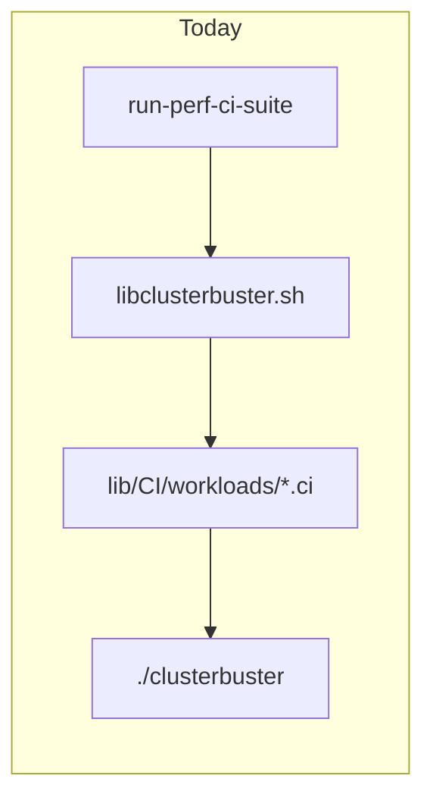
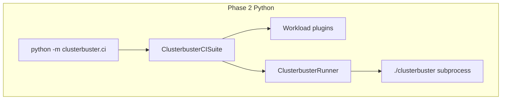

# ClusterBuster Phase 2: Python CI suite

This document describes the design for replacing the bash [`run-perf-ci-suite`](../run-perf-ci-suite) driver and the sourced shell fragments under [`lib/CI/workloads/`](../lib/CI/workloads/) with a modular Python package under **`lib/clusterbuster/ci/`**, installable via the existing [`pyproject.toml`](../pyproject.toml).

## Goals

- **CLI and library**: The same behavior is available as a command-line entry point (`python -m clusterbuster.ci`) and as a **`ClusterbusterCISuite`** class for larger Python test harnesses.
- **Full parity**: All six CI workloads today (`memory`, `fio`, `uperf`, `files`, `cpusoaker`, `hammerdb`) are implemented as Python plugins; behavioral parity with the current bash `.ci` + `run_clusterbuster_1` paths is the acceptance bar.
- **Shell fragments are not reused**: `.ci` files cannot be sourced from Python. Each workload’s matrix logic is reimplemented in Python (see *Why not wrap bash* below).
- **Phase 3 boundary**: The main [`clusterbuster`](../clusterbuster) script remains bash for Phase 2. The Python CI layer invokes it through a **`ClusterbusterRunner`** abstraction (typically subprocess argv). Phase 3 can swap the runner for an in-process or API-native implementation without rewriting orchestration or workload plugins.

## Current vs target architecture





## Public API

| Symbol | Role |
|--------|------|
| **`ClusterbusterCISuite`** | Orchestrates one full CI run: profiles/options, runtime classes, per-workload plugins, job execution, artifacts. |
| **`ClusterbusterCISuiteConfig`** | Dataclass (or equivalent) holding artifact dir, workload list, runtime classes, global timeouts, pin nodes, UUID, dry-run (`-n`), passthrough args, etc. |
| **`ClusterbusterRunner`** | Protocol: invoke `clusterbuster` with a full argv (and cwd/env). Default: **`SubprocessClusterbusterRunner`**. |
| **`WorkloadPlugin`** | Protocol per workload: initialize state, parse workload-scoped CI options, run the test matrix for the given execution context. |

## Package layout

```
lib/clusterbuster/ci/
  __init__.py          # exports ClusterbusterCISuite, config, runner, registry
  __main__.py          # CLI entry
  config.py            # ClusterbusterCISuiteConfig
  suite.py             # ClusterbusterCISuite
  runner.py            # ClusterbusterRunner, SubprocessClusterbusterRunner
  ci_options.py        # parse_ci_option / workload:runtime scoping (bash parity)
  registry.py          # workload name → plugin
  execution.py         # per-run context: run_one job (bash run_clusterbuster_1)
  compat/
    sizes.py           # parse_size (from libclusterbuster.sh)
    options.py         # parse_option, parse_optvalues, bool helpers
  workloads/
    memory.py
    fio.py
    uperf.py
    files.py
    cpusoaker.py
    hammerdb.py
```

**Phase 3 note**: `compat/*` and `ci_options.py` are candidates to merge into a future `clusterbuster.core` once the main driver is Python.

## Porting map (from bash)

| Concern | Bash source | Python module |
|---------|-------------|----------------|
| Size parsing | `parse_size` | `clusterbuster.ci.compat.sizes` |
| Option tokens | `parse_option`, `parse_optvalues`, `bool` | `clusterbuster.ci.compat.options` |
| Scoped CI options | `parse_ci_option`, `_check_ci_option` | `clusterbuster.ci.ci_options` |
| Job argv + artifacts | `run_clusterbuster_1` | `clusterbuster.ci.execution` + `ClusterbusterCISuite` |

## Workload coverage (all six)

| Workload | Source fragment | Python module |
|----------|-----------------|---------------|
| memory | [`lib/CI/workloads/memory.ci`](../lib/CI/workloads/memory.ci) | `clusterbuster.ci.workloads.memory` |
| fio | [`lib/CI/workloads/fio.ci`](../lib/CI/workloads/fio.ci) | `clusterbuster.ci.workloads.fio` |
| uperf | [`lib/CI/workloads/uperf.ci`](../lib/CI/workloads/uperf.ci) | `clusterbuster.ci.workloads.uperf` |
| files | [`lib/CI/workloads/files.ci`](../lib/CI/workloads/files.ci) | `clusterbuster.ci.workloads.files` |
| cpusoaker | [`lib/CI/workloads/cpusoaker.ci`](../lib/CI/workloads/cpusoaker.ci) | `clusterbuster.ci.workloads.cpusoaker` |
| hammerdb | [`lib/CI/workloads/hammerdb.ci`](../lib/CI/workloads/hammerdb.ci) | `clusterbuster.ci.workloads.hammerdb` |

## Orchestrator responsibilities (from `run-perf-ci-suite`)

The Python suite must eventually match or deliberately document gaps for:

- CLI: long options (`--key=value`), repeated `-n` for dry run, workload list positional args.
- Profile files: [`lib/CI/profiles/*.yaml`](../lib/CI/profiles/) — YAML (`options:` mapping; repeated keys as lists), expanded to `key=value` lines for `process_option` via `python -m clusterbuster.ci.profile_yaml`. Legacy `.profile` line files are still accepted if present.
- Runtime class discovery and filtering (`check_runtimeclass`, aarch64 + VM policy via `CB_ALLOW_VM_AARCH64`).
- Job execution: artifact dirs, tmp `.tmp` rename, failure suffix, counters, job timing, optional restart mode.
- Side features: `force-pull-clusterbuster-image`, Prometheus snapshot hooks, venv for `analyze-clusterbuster-report`, global timeout, signal handling.

Initial implementation may land core orchestration + job running first; side features can follow in the same Phase 2 branch with explicit “parity” checklists.

## Testing strategy

- **Unit**: `parse_size`, `parse_ci_option` (including bash `test_parse` cases from `run-perf-ci-suite`).
- **Component**: constructed argv for fixed config + profile snippets per workload.
- **Integration**: `./clusterbuster -n` with composed argv where possible; full live runs per project remote rules.

## Migration

- Keep the existing bash **`run-perf-ci-suite`** as a thin wrapper that delegates to `python -m clusterbuster.ci` until all consumers switch; then remove or reduce to a deprecation stub.

## Why not wrap bash

The `.ci` files depend on `source`, dynamic function names (`memory_test`), and globals injected by the driver (`runtimeclasses`, `counter`, `workload`). Calling `bash -c 'source …'` from Python is brittle and unmaintainable. Python uses explicit plugins and a typed execution context instead.

## Out of scope (Phase 3+)

- Replacing the main [`clusterbuster`](../clusterbuster) bash script.
- Rewriting [`lib/workloads/*.workload`](../lib/workloads/) — only **CI orchestration** and **CI workload matrices** move into `clusterbuster.ci`.
